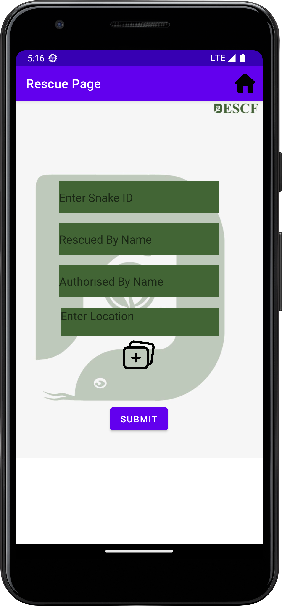
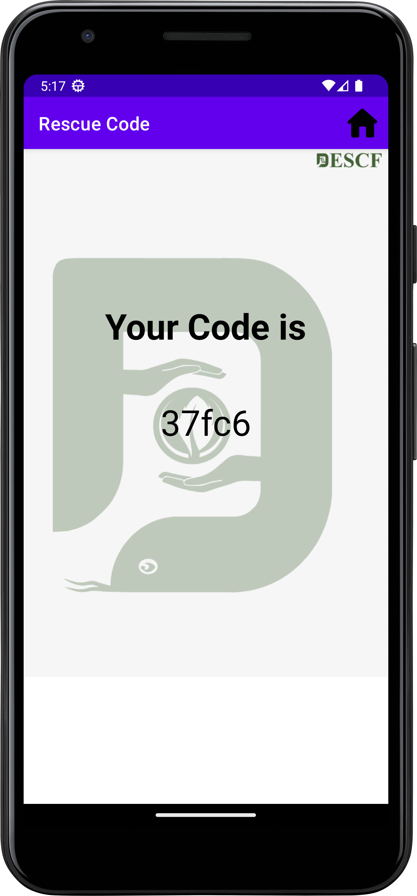
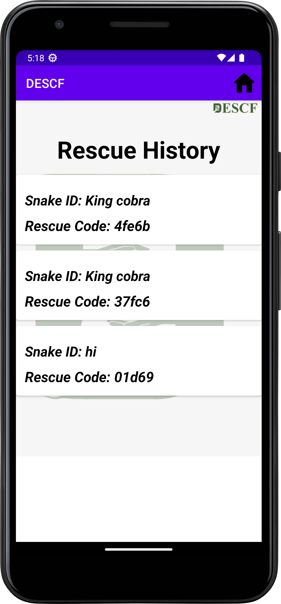
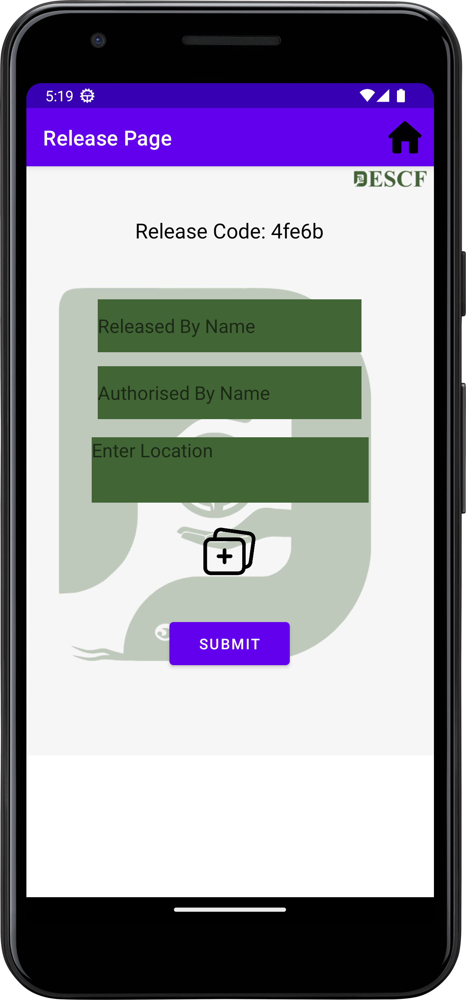

# DESCF
This App was Created By Sadman Sakib Mahee
 
Hi i have made this app using Java and for database i have used Firebase because firebase is easy to use and it is free.
 
- This app is a simple app which can be used to store your daily expenses and income.
 
- This app is very easy to use and it is very user friendly.
 
 
<h4> For Building this app please modify the <code>google-services.json</code> file with your own firebase project's <code>google-services.json</code> file. </h4>

# SCREENSHOTS

 - ## Login Page:
    This is the login page of the app. Here User can login with the key provided by the admin.
     
     
    
     
     
    
-  ## Home page:
   This is the home page of the app. Here there is Two Options available for user One is Rescue and Another is Release. Also user got a history button to look how many releases are pending
     
     
    
     
     
-  ## Rescue page: 
    This is the rescue page of the app. Where user will put the details of the rescue like Snake id , Rescuer name etc. Also the main important Authorisers name. Here user can Select Any kinds of files Single or multiple.
      
      
     
      
      
-  ## Rescue Code page:
    This is the Page where after a successful rescue there will be a code generated and by this code the releaser will release the Snake.Thats why this code is very important this code will store into history page
      
      
     
      
      
-  ## History page:
   This Page contains Snake id and Snake name.Which can be easier for the releaser.if the releaser have to release he had to give the key which is the basically random id generated after a successful resuce
     
     
    
     
     
-  ## Rescue Code Verify page:
    This is the page where releaser will put the code which is generated after a successful rescue. If the code is correct then the releaser can release the snake.
      
      
     
      
      
-  ## Release page:
    This is the release page of the app. Where user will put the details of the release like Snake id , Releaser name etc. Also the main important Authorisers name. Here user can Select Any kinds of files Single or multiple.
      
      
     
      
      
